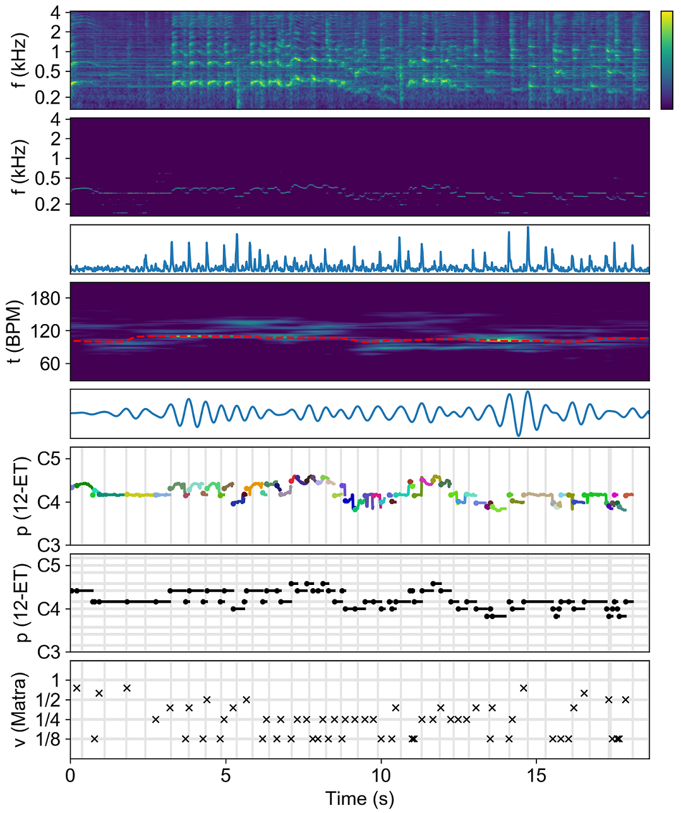

# Automatic Music Transcription for Sitar Music Analysis

Automatic music transcription (AMT) of non-Western music is a challenging task. How to utilize the imperfect results for computational musicology research remains open questions.

In this work, we report a novel AMT method, HMLC-CFP, and a set of computational music analysis strategies for sitar recordings. The proposed AMT method is based on harmonic multi-layered cepstrum (HMLC) and combined frequency-periodicity (CFP) signal representations. We also provide the tonal, temporal and structural analysis of the studied recording fully based on the AMT result. 

Our proposed AMT method produces improved results compared to other existing methods, and we further demonstrate the advantages of using this AMT method in musicological analysis, with a particular focus on how transcription errors impact the analysis results.

## Summary of the supplementary materials

The supplementary materials contain the following items:
* Source code for transcription, structure analysis, evaluation and plots
* The original audio sample performed by Debashish
* Human transcription (.pdf) done by one of the authors of this paper 
* The MIDI file converted from the human transcription, serving as ground truth
* MIDI files outputted from the proposed AMT algorithm and the two baselines

These structure of the supplementary materials:
* The source code are at the current dictionary. 
* The audio recording, human transcription and the ground truth MIDI are in \case_study_sample  
* Transcription results (MIDI) of the proposed method are in \result 
* Transcription results of the baseline methods are in \baselines

## How to run the code

Environment:
- python 3.5
- soundfile 0.10.3

Usage:
- Run **transcription_main.py** for the AMT task of the sitar recording
- Run **analysis_main.py** for the structure analysis task given the AMT result of the sitar recording

## How to cite this work

> Li Su, Alec Cooper and Yu-Fen Huang, "Automatic Music Transcription for Sitar Music Analysis," to appear in Journal of New Music Research (JNMR).
